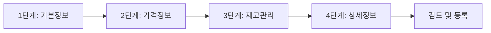

# 상품 등록 가이드

이 가이드는 React OMS에서 새로운 상품을 등록하는 전체 과정을 단계별로 안내합니다.

## 🚀 상품 등록 시작하기

### 접근 방법

1. **메뉴 접근**: 좌측 메뉴에서 **상품 관리** > **상품 등록** 클릭
2. **단축키**: `Ctrl + N` (새 상품 등록)
3. **상품 목록에서**: 상품 목록 페이지에서 **➕ 상품 등록** 버튼 클릭

## 📋 단계별 상품 등록 과정

상품 등록은 **4단계 과정**으로 이루어집니다:



---

## 1️⃣ 1단계: 기본 정보 입력

### 필수 정보

#### 상품명 입력


- **입력 위치**: 기본 정보 섹션 최상단
- **입력 조건**: 2자 이상 100자 이하
- **허용 문자**: 한글, 영문, 숫자, 공백, 괄호, 하이픈

!!! tip "상품명 작성 팁"
    - 브랜드명을 포함하세요: `Nike 에어맥스 운동화`
    - 핵심 특징을 명시하세요: `프리미엄 코튼 100% 티셔츠`
    - 색상/사이즈는 옵션으로 처리: `베이직 청바지 (블루)`

**올바른 예시:**
```
✅ 프리미엄 코튼 반팔 티셔츠 (화이트)
✅ Nike Air Max 270 운동화
✅ 슬림핏 청바지 - 스트레치 소재
```

**잘못된 예시:**
```
❌ 티 (너무 짧음)
❌ <script>alert('test')</script> (HTML 태그)
❌ 상품상품상품상품상품상품상품상품상품상품상품상품상품상품상품상품상품상품상품상품상품상품상품상품상품상품상품 (너무 김)
```

#### 카테고리 선택


카테고리는 **계층형 구조**로 되어 있습니다.

1. **대분류 선택**: 의류, 잡화, 전자제품 등
2. **중분류 선택**: 상의, 하의, 아우터 등  
3. **소분류 선택**: 티셔츠, 셔츠, 블라우스 등
4. **세분류 선택** (선택사항): 반팔, 긴팔 등

**카테고리 선택 예시:**
```
의류 > 상의 > 티셔츠 > 반팔티
잡화 > 가방 > 백팩 > 스포츠백팩
전자제품 > 스마트폰 > 안드로이드 > 갤럭시
```

!!! warning "카테고리 선택 주의사항"
    - 잘못된 카테고리 선택 시 고객이 상품을 찾기 어려워집니다
    - 쇼핑몰 연동 시 카테고리 매핑에 영향을 줍니다
    - 등록 후 카테고리 변경이 가능하지만 신중하게 선택하세요

#### 브랜드 입력

- **입력 방식**: 직접 입력 또는 기존 브랜드 선택
- **자동완성**: 입력 시 기존 브랜드 목록 자동완성
- **신규 브랜드**: 없는 브랜드는 새로 추가됩니다

### 선택 정보

#### 상품 코드 (SKU)
- **자동 생성**: 시스템에서 자동으로 생성됩니다
- **수동 입력**: 기존 상품 코드가 있다면 직접 입력 가능
- **형식**: `PRD-YYYYMMDD-XXXXXX` (예: PRD-20240115-000001)

#### 제조사/공급업체
- **선택사항**: 필요에 따라 입력
- **관리용**: 재고 관리 및 발주에 활용

---

## 2️⃣ 2단계: 가격 정보 설정

### 가격 입력 방식

#### 판매가격 (필수)


- **입력 형식**: 숫자만 입력 (콤마는 자동 생성)
- **최소가격**: 100원
- **최대가격**: 99,999,999원

**입력 예시:**
```
입력: 29000
표시: 29,000원
```

#### 원가 입력 (선택)
- **용도**: 수익률 계산, 내부 관리용
- **조건**: 판매가격보다 크거나 같아야 함
- **할인율**: 자동 계산됩니다

```javascript
할인율 = (원가 - 판매가격) / 원가 × 100
```

**가격 설정 예시:**
```
원가: 40,000원
판매가: 29,000원
할인율: 27.5% (자동 계산)
```

### 할인 정책

#### 정가 대비 할인
- **정가 설정**: 할인 전 정상 가격
- **할인가 설정**: 실제 판매 가격
- **할인 표시**: 고객에게 할인율 표시

#### 기간 한정 할인
- **시작일**: 할인 시작 날짜/시간
- **종료일**: 할인 종료 날짜/시간
- **자동 전환**: 기간 만료 시 정가로 자동 전환

---

## 3️⃣ 3단계: 재고 관리 설정

### 재고 수량 설정

#### 초기 재고


- **입력값**: 0개 이상의 정수
- **단위**: 개, 세트, 박스 등 선택 가능
- **무제한**: 무제한 재고 옵션 제공

#### 안전 재고
```
안전 재고: 10개 (권장)
의미: 재고가 10개 이하로 떨어지면 알림
```

- **목적**: 품절 방지를 위한 최소 재고량
- **알림**: 안전 재고 이하 시 자동 알림
- **발주**: 자동 발주 기준점으로 활용

### 재고 추적 옵션

#### 재고 추적 방식

=== "단순 재고"
    - 전체 상품의 총 재고만 관리
    - 옵션이 없는 단일 상품에 적합
    
=== "옵션별 재고"
    - 색상, 사이즈별로 개별 재고 관리
    - 다양한 옵션이 있는 상품에 적합

#### 재고 감소 시점
- **주문 시**: 주문이 들어오는 즉시 재고 감소
- **결제 시**: 결제가 완료된 후 재고 감소
- **출고 시**: 실제 상품이 출고된 후 재고 감소

---

## 4️⃣ 4단계: 상세 정보 입력

### 상품 설명

#### 간단 설명 (필수)
- **위치**: 상품 목록에서 표시되는 짧은 설명
- **길이**: 50자 이내 권장
- **내용**: 핵심 특징을 간략하게

**예시:**
```
✅ 100% 순면 소재의 부드러운 착용감
✅ 4계절 내내 입기 좋은 베이직 디자인
✅ 세탁이 쉽고 형태가 잘 유지되는 고품질
```

#### 상세 설명 (선택)


- **에디터**: 리치 텍스트 에디터 제공
- **길이**: 2000자 이내
- **HTML**: 기본적인 HTML 태그 지원

**지원 태그:**
```html
<p>문단</p>
<br>줄바꿈
<strong>굵은 글씨</strong>
<em>기울임</em>
<ul><li>순서 없는 목록</li></ul>
<ol><li>순서 있는 목록</li></ol>
```

### 상품 이미지

#### 이미지 업로드


- **개수 제한**: 최대 10개
- **파일 크기**: 파일당 5MB 이하
- **지원 형식**: JPG, PNG, WebP
- **권장 크기**: 800×800px 이상

#### 이미지 순서
1. **메인 이미지**: 첫 번째 이미지가 대표 이미지
2. **추가 이미지**: 드래그로 순서 변경 가능
3. **썸네일**: 자동으로 썸네일 생성

!!! tip "이미지 촬영 팁"
    - **조명**: 자연광 또는 밝은 조명 사용
    - **배경**: 깔끔한 단색 배경 권장
    - **각도**: 다양한 각도에서 촬영
    - **디테일**: 중요한 부분은 확대 촬영

### 상품 옵션 설정

#### 옵션 타입

=== "단일 옵션"
    ```
    색상: 화이트, 블랙, 그레이
    → 고객이 하나의 색상만 선택
    ```

=== "조합 옵션"
    ```
    색상: 화이트, 블랙
    사이즈: S, M, L
    → 화이트-S, 화이트-M, 블랙-L 등 조합
    ```

#### 옵션별 설정
- **추가 금액**: 옵션별 추가 요금
- **재고**: 옵션별 개별 재고 관리
- **이미지**: 옵션별 대표 이미지

---

## 5️⃣ 검토 및 등록

### 등록 전 검토

#### 필수 항목 체크리스트
- [ ] 상품명 입력 완료
- [ ] 카테고리 선택 완료
- [ ] 가격 설정 완료
- [ ] 재고 수량 설정 완료

#### 선택 항목 체크리스트
- [ ] 브랜드 정보
- [ ] 상세 설명
- [ ] 상품 이미지
- [ ] 상품 옵션

### 미리보기

등록하기 전 **미리보기** 기능으로 고객에게 어떻게 보일지 확인할 수 있습니다.


### 등록 완료

모든 정보 입력이 완료되면:

1. **등록** 버튼 클릭
2. 최종 검증 진행
3. 등록 완료 알림
4. 상품 상세 페이지로 자동 이동

## 🔄 등록 후 관리

### 상품 수정
- **경로**: 상품 목록 > 상품 선택 > 수정 버튼
- **권한**: 관리자 및 등록자만 수정 가능
- **이력**: 모든 수정 사항은 이력으로 저장

### 상품 복사
- **용도**: 비슷한 상품을 쉽게 등록
- **방법**: 기존 상품에서 **복사** 버튼 클릭
- **수정**: 필요한 부분만 수정하여 새 상품으로 등록

### 일괄 등록
- **Excel/CSV**: 템플릿 파일을 이용한 대량 등록
- **API**: 외부 시스템에서 API를 통한 등록
- **가이드**: [일괄 등록 가이드](bulk-upload.md) 참조

## ⚠️ 주의사항

### 저작권 관련
- **이미지**: 저작권이 있는 이미지 사용 금지
- **설명문**: 타 업체 설명문 무단 복사 금지
- **브랜드**: 정식 브랜드명만 사용

### 법적 준수사항
- **의료기기**: 의료기기법 준수 필요
- **건강기능식품**: 관련 법규 준수 필요
- **전자제품**: KC 인증 표시 필요

!!! danger "중요한 금지사항"
    - 가짜, 모조품, 복제품 등록 절대 금지
    - 법적으로 판매가 금지된 상품 등록 금지
    - 과대/허위 광고성 표현 사용 금지

## 🆘 도움이 필요한 경우

### 자주 묻는 질문
- [상품 등록 FAQ](../faq/product-registration.md)
- [에러 해결 가이드](../troubleshooting/product-errors.md)

### 지원 요청
- **이메일**: product-support@react-oms.com
- **전화**: 02-1234-5678 (평일 9:00-18:00)
- **채팅**: 우하단 채팅 버튼 클릭

---

**다음 단계:** [상품 수정 가이드](edit.md) | [카테고리 관리](categories.md)
