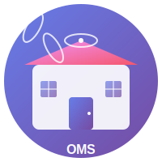
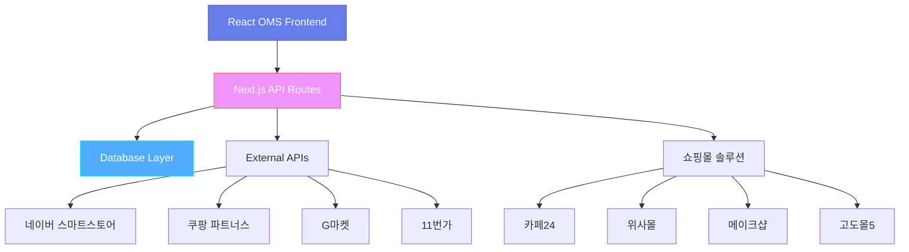

# 🚀 React OMS - Professional Order Management System

<div style="text-align: center; margin: 2rem 0;">
  
  <p style="font-size: 1.2rem; color: #667eea; font-weight: 500;">
    완벽한 주문 관리 시스템으로 비즈니스를 한 단계 업그레이드하세요
  </p>
</div>

---

## ✨ 주요 특징

<div class="grid cards" markdown>

-   :fontawesome-solid-rocket:{ .lg .middle } **Lightning Fast**

    ---

    React 18과 Next.js 13 App Directory를 활용한 
    **초고속 성능**과 **서버사이드 렌더링** 지원

-   :fontawesome-solid-link:{ .lg .middle } **Multi-Platform**

    ---

    네이버, 쿠팡, G마켓, 11번가 등 
    **주요 쇼핑몰 플랫폼 완벽 연동**

-   :fontawesome-solid-shield-halved:{ .lg .middle } **Enterprise Ready**

    ---

    **Docker 컨테이너화**와 **프로덕션 급 보안**으로 
    안정적인 서비스 운영 보장

-   :fontawesome-solid-chart-line:{ .lg .middle } **Smart Analytics**

    ---

    **실시간 데이터 분석**과 **자동화된 리포팅**으로 
    비즈니스 인사이트 제공

</div>

## 🏗️ 시스템 아키텍처



## 🎯 주요 기능

### 📦 상품 관리
!!! success "완벽한 상품 관리 시스템"
    - **일괄 상품 등록** 및 수정
    - **카테고리별 분류** 시스템
    - **재고 자동 관리** 및 알림
    - **이미지 최적화** 자동 처리

### 🛒 주문 처리
!!! info "스마트한 주문 관리"
    - **실시간 주문 동기화**
    - **자동 배송 처리**
    - **고객 커뮤니케이션** 자동화
    - **결제 상태 추적**

### 📊 분석 및 리포팅
!!! tip "데이터 기반 의사결정"
    - **매출 분석 대시보드**
    - **고객 행동 분석**
    - **재고 회전율** 모니터링
    - **수익성 분석** 리포트

## 🚀 빠른 시작

=== "Docker로 시작하기"

    ```bash
    # 저장소 클론
    git clone https://github.com/react-oms/react-oms.git
    cd react-oms
    
    # Docker 컨테이너 실행
    docker-compose up -d
    
    # 브라우저에서 접속
    # http://localhost:5050
    ```

=== "개발 환경 설정"

    ```bash
    # 의존성 설치
    npm install
    
    # 환경 변수 설정
    cp .env.example .env.local
    
    # 개발 서버 실행
    npm run dev
    
    # 브라우저에서 접속
    # http://localhost:3000
    ```

=== "프로덕션 배포"

    ```bash
    # 빌드
    npm run build
    
    # 프로덕션 서버 실행
    npm run start
    
    # PM2를 사용한 배포
    pm2 start ecosystem.config.js
    ```

## 📋 지원 플랫폼

### 🛍️ 주요 쇼핑몰
| 플랫폼 | 연동 상태 | API 버전 | 지원 기능 |
|--------|-----------|----------|-----------|
| **네이버 스마트스토어** | ✅ 완료 | v2.0 | 상품, 주문, 정산 |
| **쿠팡 파트너스** | ✅ 완료 | v4.0 | 상품, 주문, 배송 |
| **G마켓** | ✅ 완료 | v3.0 | 상품, 주문, 클레임 |
| **11번가** | ✅ 완료 | v2.1 | 상품, 주문, 정산 |

### 🏪 쇼핑몰 솔루션
| 솔루션 | 연동 상태 | 연동 방식 | 지원 기능 |
|--------|-----------|-----------|-----------|
| **카페24** | ✅ 완료 | REST API | 상품, 주문, 회원 |
| **위사몰** | ✅ 완료 | SOAP API | 상품, 주문, 배송 |
| **메이크샵** | ✅ 완료 | REST API | 상품, 주문, 정산 |
| **고도몰5** | ✅ 완료 | REST API | 상품, 주문, 리뷰 |

## 📚 문서 구조

<div class="grid cards" markdown>

-   :material-book-open-page-variant:{ .lg .middle } **[사용자 가이드](quick-start.md)**

    ---

    시스템 설치부터 운영까지 **단계별 가이드**

-   :material-policy:{ .lg .middle } **[정책 문서](policy/data-policy.md)**

    ---

    **서비스 이용약관**, **개인정보 처리방침** 등 모든 정책

-   :material-api:{ .lg .middle } **API 레퍼런스**

    ---

    **REST API** 명세서와 **개발자 가이드**

-   :material-docker:{ .lg .middle } **배포 가이드**

    ---

    **Docker**, **AWS**, **GCP** 등 다양한 배포 방법

</div>

## 🎉 성공 사례

!!! quote "고객 후기"
    "React OMS 도입 후 **주문 처리 시간이 70% 단축**되었고, **매출이 40% 증가**했습니다. 특히 다중 플랫폼 관리가 획기적으로 개선되었어요!" 
    
    **— 김○○ 대표, ○○쇼핑몰**

### 📈 주요 성과 지표

<div style="display: flex; gap: 2rem; flex-wrap: wrap; justify-content: center; margin: 2rem 0;">
  <div style="text-align: center; padding: 1.5rem; background: linear-gradient(135deg, rgba(102, 126, 234, 0.1), rgba(118, 75, 162, 0.05)); border-radius: 12px; min-width: 150px;">
    <div style="font-size: 2.5rem; font-weight: 800; color: #667eea;">70%</div>
    <div style="font-size: 0.9rem; color: #666; margin-top: 0.5rem;">처리시간 단축</div>
  </div>
  <div style="text-align: center; padding: 1.5rem; background: linear-gradient(135deg, rgba(79, 172, 254, 0.1), rgba(0, 242, 254, 0.05)); border-radius: 12px; min-width: 150px;">
    <div style="font-size: 2.5rem; font-weight: 800; color: #4facfe;">40%</div>
    <div style="font-size: 0.9rem; color: #666; margin-top: 0.5rem;">매출 증가</div>
  </div>
  <div style="text-align: center; padding: 1.5rem; background: linear-gradient(135deg, rgba(250, 217, 97, 0.1), rgba(247, 107, 28, 0.05)); border-radius: 12px; min-width: 150px;">
    <div style="font-size: 2.5rem; font-weight: 800; color: #fad961;">99.9%</div>
    <div style="font-size: 0.9rem; color: #666; margin-top: 0.5rem;">서비스 가동률</div>
  </div>
  <div style="text-align: center; padding: 1.5rem; background: linear-gradient(135deg, rgba(250, 112, 154, 0.1), rgba(254, 225, 64, 0.05)); border-radius: 12px; min-width: 150px;">
    <div style="font-size: 2.5rem; font-weight: 800; color: #fa709a;">24/7</div>
    <div style="font-size: 0.9rem; color: #666; margin-top: 0.5rem;">무중단 서비스</div>
  </div>
</div>

## 🔧 기술 스택

### Frontend
- **React 18** - 최신 리액트 생태계
- **Next.js 13** - App Directory 활용
- **TypeScript** - 타입 안전성
- **Tailwind CSS** - 유틸리티 CSS 프레임워크

### Backend  
- **Node.js** - 서버사이드 JavaScript
- **Express.js** - 웹 프레임워크
- **PostgreSQL** - 관계형 데이터베이스
- **Redis** - 캐싱 및 세션 관리

### DevOps
- **Docker** - 컨테이너화
- **GitHub Actions** - CI/CD 파이프라인
- **AWS/GCP** - 클라우드 배포
- **Monitoring** - 실시간 모니터링

## 💪 커뮤니티

<div class="grid cards" markdown>

-   :fontawesome-brands-github:{ .lg .middle } **[GitHub](https://github.com/react-oms)**

    ---

    소스코드, 이슈 트래킹, 기여 가이드

-   :fontawesome-brands-discord:{ .lg .middle } **Discord**

    ---

    실시간 커뮤니티 채팅 및 기술 지원

-   :material-email:{ .lg .middle } **[support@react-oms.com](mailto:support@react-oms.com)**

    ---

    기술 지원 및 비즈니스 문의

-   :material-book-multiple:{ .lg .middle } **[블로그](https://blog.react-oms.com)**

    ---

    업데이트 소식 및 기술 아티클

</div>

## 🏁 지금 시작하세요!

!!! success "무료 체험 가능"
    **30일 무료 체험**으로 React OMS의 강력한 기능을 직접 경험해보세요!

<div style="text-align: center; margin: 3rem 0;">
  <a href="quick-start.md" class="md-button md-button--primary" style="margin-right: 1rem; padding: 1rem 2rem; font-size: 1.1rem; font-weight: 600;">
    🚀 빠른 시작 가이드
  </a>
  <a href="https://github.com/react-oms/react-oms" class="md-button" style="padding: 1rem 2rem; font-size: 1.1rem; font-weight: 600; background: transparent; color: #667eea; border: 2px solid #667eea;">
    💻 GitHub에서 보기
  </a>
</div>

---

<div style="text-align: center; margin: 2rem 0; padding: 2rem; background: linear-gradient(135deg, rgba(102, 126, 234, 0.05), rgba(118, 75, 162, 0.02)); border-radius: 12px;">
  <h3 style="color: #667eea; margin-bottom: 1rem;">🎯 React OMS와 함께 성공하세요!</h3>
  <p style="color: #666; font-size: 1.1rem; line-height: 1.6;">
    전문적인 주문 관리 시스템으로 비즈니스 효율성을 극대화하고,<br>
    고객 만족도를 향상시키며, 매출 성장을 가속화하세요.
  </p>
</div>
