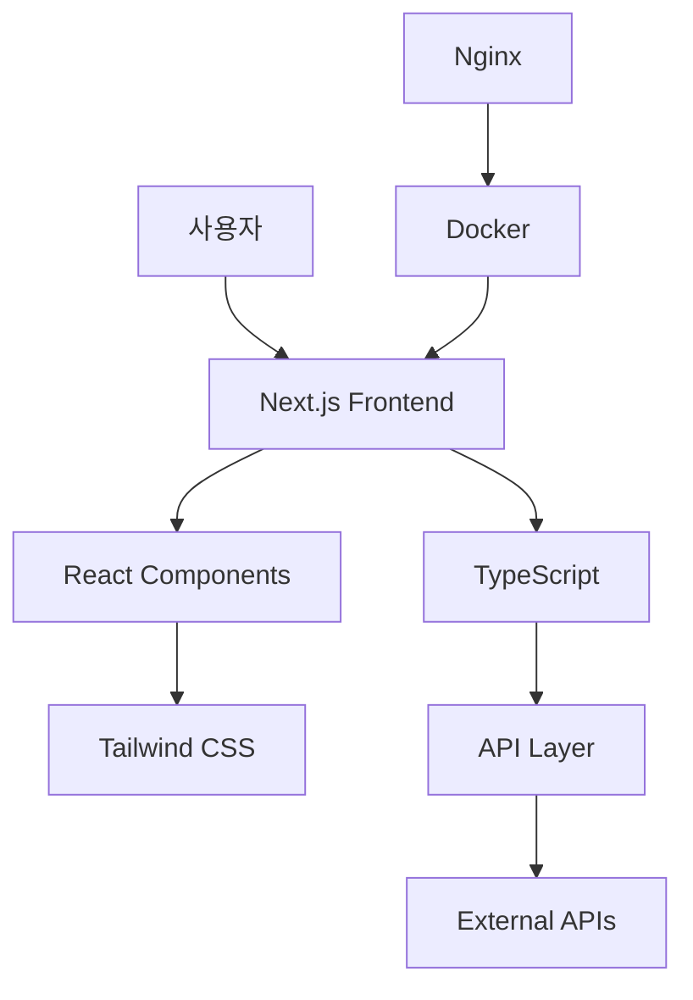
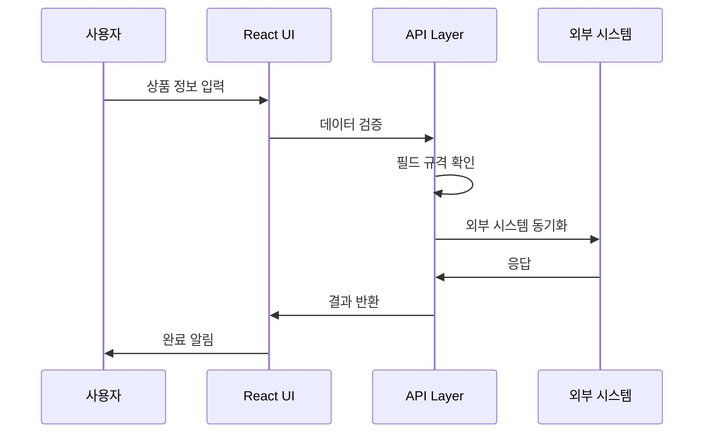
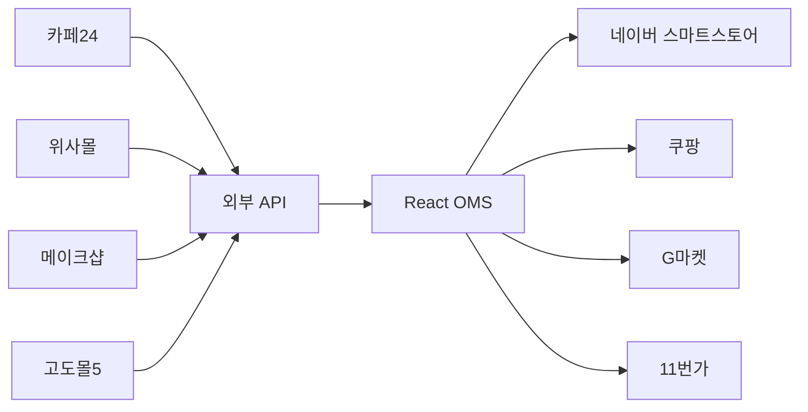

# 시스템 개요

## 🏗️ React OMS 아키텍처

React OMS는 모던 웹 기술 스택을 기반으로 한 확장 가능한 주문 관리 시스템입니다.

### 기술 스택



| 레이어 | 기술 | 버전 | 역할 |
|--------|------|------|------|
| **Frontend** | Next.js | 13.5.11 | 서버사이드 렌더링, 라우팅 |
| **언어** | TypeScript | 5.9.2 | 타입 안전성, 개발 생산성 |
| **스타일링** | Tailwind CSS | 3.4.3 | 유틸리티 기반 디자인 |
| **컨테이너** | Docker | 28.3.3 | 애플리케이션 패키징 |
| **프록시** | Nginx | Latest | 리버스 프록시, 로드 밸런싱 |

## 📦 모듈 구조

### Core Modules

=== "상품 관리"
    ```
    /products
    ├── 상품 목록 (필터링, 검색, 정렬)
    ├── 상품 등록 (다단계 폼)
    ├── 상품 상세 (조회, 수정)
    └── 카테고리 관리 (계층형 트리)
    ```

=== "쇼핑몰 관리"
    ```
    /malls
    ├── 대시보드 (통계, 현황)
    ├── 채널별 상품 관리
    ├── 부가 정보 관리
    └── 카테고리 매핑
    ```

=== "외부 API"
    ```
    /api-integration
    ├── 플랫폼 선택
    ├── 인증 설정
    ├── 데이터 조회
    ├── 매핑 설정
    └── 일괄 등록
    ```

## 🔄 데이터 플로우

### 상품 등록 프로세스



### 멀티채널 동기화



## 🎯 핵심 특징

### 성능 최적화

!!! success "고성능"
    - **메모리 사용량**: 36MB (매우 효율적)
    - **시작 시간**: 34ms (초고속)
    - **번들 크기**: 최적화된 코드 분할
    - **캐싱**: 브라우저 및 서버 캐싱

### 확장성

!!! info "확장 가능한 아키텍처"
    - **모듈형 설계**: 독립적인 기능 모듈
    - **API 기반**: RESTful API 아키텍처
    - **컨테이너화**: Docker 기반 마이크로서비스 준비
    - **데이터베이스**: 다중 데이터베이스 지원 가능

### 보안

!!! warning "보안 강화"
    - **비루트 실행**: 컨테이너 보안
    - **HTTPS 지원**: SSL/TLS 암호화
    - **입력 검증**: 모든 데이터 검증
    - **환경 변수**: 민감 정보 보호

## 🌐 지원 플랫폼

### 쇼핑몰 채널

| 플랫폼 | 상태 | 기능 | API 버전 |
|--------|------|------|----------|
| 네이버 스마트스토어 | ✅ 지원 | 상품, 주문, 통계 | v2.0 |
| 쿠팡 | ✅ 지원 | 상품, 재고, 주문 | v1.0 |
| G마켓 | ✅ 지원 | 상품, 카테고리 | v3.0 |
| 11번가 | ✅ 지원 | 상품, 주문 관리 | v2.5 |

### 외부 API 연동

| 플랫폼 | 상태 | 주요 기능 | 연동 방식 |
|--------|------|-----------|-----------|
| 카페24 | ✅ 지원 | 상품 불러오기 | REST API |
| 위사몰 | ✅ 지원 | 상품 동기화 | REST API |
| 메이크샵 | ✅ 지원 | 대량 등록 | REST API |
| 고도몰5 | ✅ 지원 | 실시간 연동 | REST API |
| 네이버 커머스 | ✅ 지원 | 상품 정보 | REST API |

## 📊 시스템 요구사항

### 최소 요구사항

| 항목 | 요구사항 |
|------|----------|
| **OS** | Linux, macOS, Windows |
| **메모리** | 4GB RAM |
| **저장공간** | 10GB |
| **네트워크** | 안정적인 인터넷 연결 |

### 권장 요구사항

| 항목 | 권장사항 |
|------|----------|
| **OS** | Linux (Ubuntu 20.04+) |
| **메모리** | 8GB+ RAM |
| **저장공간** | 50GB+ SSD |
| **네트워크** | 100Mbps+ |

## 🔮 향후 계획

### 단기 목표 (3개월)
- [ ] PostgreSQL 데이터베이스 연동
- [ ] 실시간 알림 시스템
- [ ] 모바일 반응형 개선
- [ ] API 문서 자동화

### 중기 목표 (6개월)
- [ ] AI 기반 재고 예측
- [ ] 고급 분석 대시보드
- [ ] 다국어 지원
- [ ] 모바일 앱 개발

### 장기 목표 (12개월)
- [ ] Kubernetes 마이그레이션
- [ ] 마이크로서비스 아키텍처
- [ ] 글로벌 서비스 확장
- [ ] 머신러닝 통합
